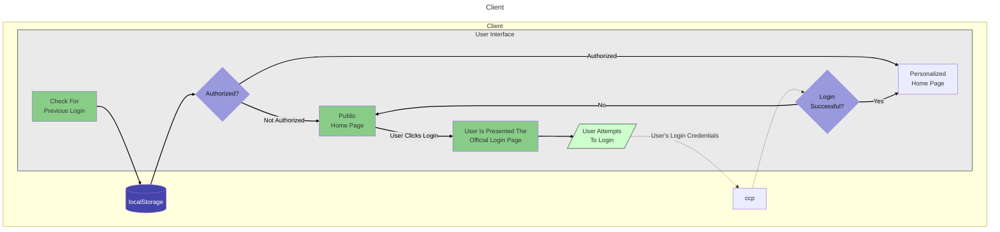

# Client

```mermaid
---
title: Client
---

graph BT

    subgraph Client
        direction LR
    indexDb[("`localStorage`")];
    
    checkAuth:::process ==> indexDb;
    indexDb:::storedData ==> authCheck;

    subgraph interface["User Interface"]
        direction TB

        checkAuth["Check For
            Previous Login"];

        authCheck{"Authorized?"};

        home["Personalized
            Home Page"];

        basicHome["Public
            Home Page"];

        loginPage["User Is Presented The
            Official Login Page"];

        login[/"User Attempts
            To Login"/];

        loginSuccess{"Login
            Successful?"};

        authCheck:::decision ==> |"Authorized"| home;
        authCheck ==> |"Not Authorized"| basicHome;
        basicHome:::process ==> |"User Clicks Login"| loginPage;
        loginPage:::process ==> login:::dataOrInputOutput;

        loginSuccess:::decision ==> |"Yes"| home;
        loginSuccess --> |"No"| basicHome;

    end

    login -.-> |"User's Login Credentials"| ccp ;
    ccp -.-> loginSuccess;
    
    end

    style interface fill:#eaeaea, stroke:#111, stroke-width:1px;

    linkStyle 0,1,2,3,4,5,6,7 stroke:#000,stroke-width:2px,color:black;

    classDef terminator fill:#188;
    classDef dataOrInputOutput fill:#cfc, stroke:#111, stroke-width:1px;
    classDef connector fill:#dd7;
    classDef decision fill:#99d,color:#111;
    classDef document fill:#177,color:white;
    classDef process fill:#8c8;
    classDef preparation fill:#9b9;
    classDef storedData fill:#44a,color:white;
```
