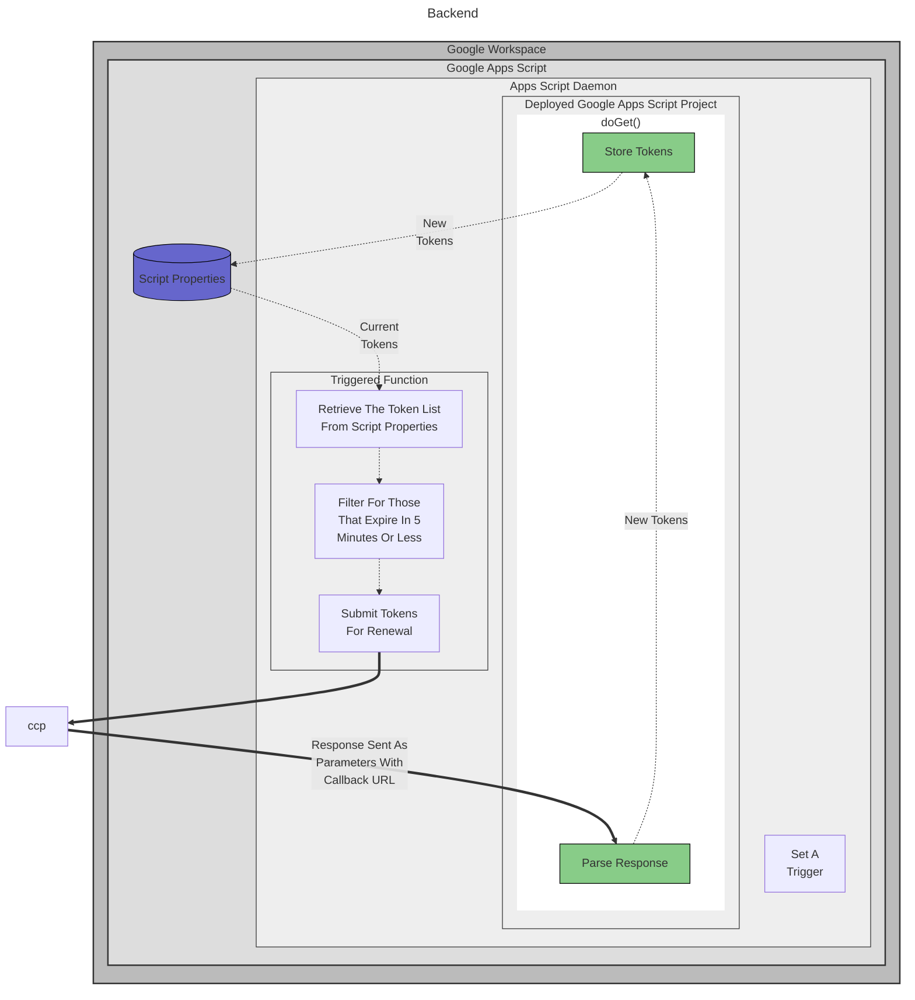

# Server

```mermaid
---
title: Backend
---

graph TB

    subgraph workspace["Google Workspace"]
        direction RL;

        writeTokens:::process -.-> |"New
            Tokens"|scriptProps;

        scriptProps:::storedData -.-> |"Current
            Tokens"|getProps;

        subgraph appsScript["Google Apps Script"]
            direction RL;


            scriptProps[("Script Properties")];

            subgraph daemon["Apps Script Daemon"]
                direction RL;

            subgraph deployed["Deployed Google Apps Script Project"]
                direction RL;

                subgraph doGet["`doGet()`"];
                    direction RL;

                    parseResponse["Parse Response"];

                    parseResponse:::process -.-> |"New Tokens"| writeTokens;

                end

            end


                writeTokens["Store Tokens"];
          
                filterTokens["Filter For Those
                    That Expire In 5
                    Minutes Or Less"];

                setTrigger["Set A
                    Trigger"];


                filterTokens -.-> renewTokens
            

            subgraph triggeredFunction["Triggered Function"]
                direction RL;

       

                getProps["Retrieve The Token List
                    From Script Properties"];

                getProps -.-> filterTokens

                renewTokens["Submit Tokens
                    For Renewal"];


            end

        end

    end

end

style workspace fill:#bbb, stroke:#333, stroke-width:2px;
style appsScript fill:#ddd, stroke:#333, stroke-width:2px;


style doGet fill:#fff, stroke:#999, stroke-width:0px;

style daemon fill:#eee, stroke:#333, stroke-width:1px;
style deployed fill:#eee, stroke:#333, stroke-width:1px;
style triggeredFunction fill:#eee, stroke:#333, stroke-width:1px;

    renewTokens ==> ccp;

    ccp ==>|"Response Sent As
            Parameters With
            Callback URL"| parseResponse;

classDef terminator fill:#188,stroke:#000,stroke-width:1px;
classDef dataOrInputOutput fill:#7d7,stroke:#000,stroke-width:1px;
classDef connector fill:#dd7,stroke:#000,stroke-width:1px;
classDef decision fill:#99d,stroke:#000,stroke-width:1px;
classDef document fill:#177,stroke:#000,stroke-width:1px;
classDef process fill:#8c8,stroke:#000,stroke-width:1px;
classDef preparation fill:#9b9,stroke:#000,stroke-width:1px;
classDef storedData fill:#66c,stroke:#000,stroke-width:1px;

```
