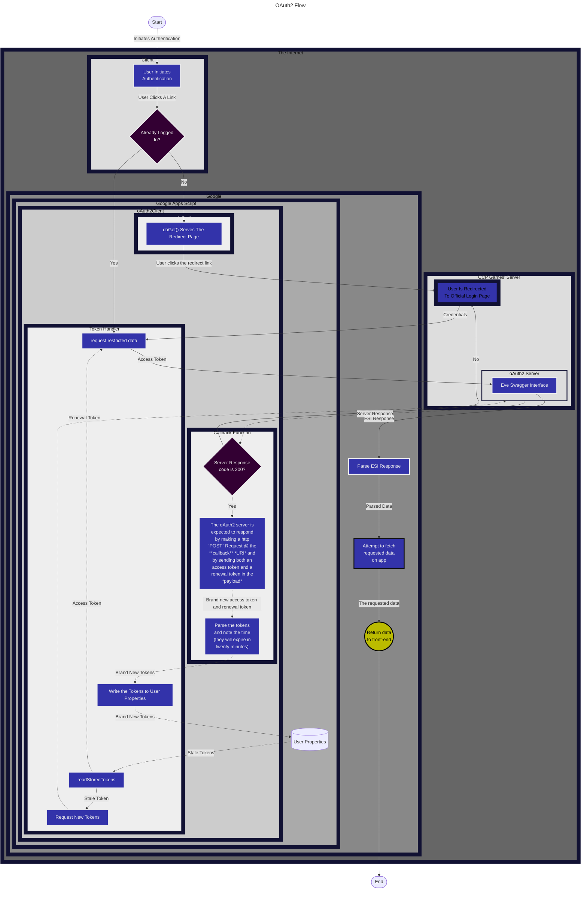

# oAuth2 Flow

```mermaid
---
title: OAuth2 Flow
---
graph TB;
  Start([Start])
  nd(["End"])
  subgraph internet["The Internet"]
    direction TB;
    style internet fill:#666,stroke:#113,stroke-width:13px,color:#111,border-radius:10px;

    subgraph ccpGamesServer["CCP Games' Server"]
      style ccpGamesServer fill:#ddd, stroke:#113,stroke-width:13px
      subgraph oAuth2Server["oAuth2 Server"]
        style oAuth2Server fill:#ddd,stroke:#113,stroke-width:3px,color:black;
        eveSwaggerInterface["Eve Swagger Interface"];
        style eveSwaggerInterface fill:#113131,stroke:#113,stroke-width:1px,color:#eee;
      end
      redirect["User Is Redirected\nTo Official Login Page"];
      style redirect fill:#33a,stroke:#113,stroke-width:13px,color:black;
    end

    subgraph Google
      direction TB;
      style Google fill:#888,stroke:#113,stroke-width:13px,color:black;
      subgraph appsScript["Google Apps Script"];
        style appsScript fill:#aaa,stroke:#113,stroke-width:13px,color:#111;
        direction TB
        style appsScript fill:#aaa,stroke:#113,stroke-width:13px;
        userProps[("User Properties")];

        subgraph oAuth2Client["oAuth2Client"]
          style oAuth2Client fill:#ccc, stroke:#113, stroke-width:13px,color:#111;
          subgraph doGet["doGet()"]
            style doGet fill:#eee,stroke:#113,stroke-width:13px,color:#eee;
            login["doGet() Serves The Redirect Page"];
            style login fill:#33a,stroke:#eee,stroke-width:3px,color:#eee;
          end

          renewToken["Request New Tokens"];
          style renewToken fill:#33a,stroke:#eee,stroke-width:3px,color:#eee;

          subgraph tokenHandler["Token Handler"]
            style tokenHandler fill:#eee, stroke: #113, stroke-width:13px,color:#111;
            readStoredTokens -.->|Stale Token| renewToken;
            readStoredTokens -.-> |"Access Token"| requestEndpoint;
            style readStoredTokens fill:#33a,stroke:#eee,stroke-width:3px,color:#eee;
            writeTokens[Write the Tokens to User Properties];
            style writeTokens fill:#33a,stroke:#eee,stroke-width:3px,color:#eee;

            requestEndpoint["request restricted data"] --> |Access Token| eveSwaggerInterface;
            style requestEndpoint fill:#33a,stroke:#eee,stroke-width:3px,color:#eee;
          end

          subgraph callback["Callback Function"]
            style callback fill:#eee,stroke:#113,stroke-width:13px,color:#111;
            successfulAuth{"Server Response\ncode is 200?"};
            style successfulAuth fill:#303,stroke:#eee,stroke-width:3px,color:#eee;
            serverRedirect["The oAuth2 server is\nexpected to respond\nby making a http\n`POST` Request @ the\n**callback** *URI* and\nby sending both an\naccess token and a\nrenewal token in the\n*payload* "];
            style serverRedirect fill:#33a,stroke:#eee,stroke-width:3px,color:#eee;
            parseTokens["Parse the tokens\nand note the time\n(they will expire in\ntwenty minutes)"];
            style parseTokens fill:#33a,stroke:#eee,stroke-width:3px,color:#eee;
          end
        end
      end
      eveSwaggerInterface --> |"ESI Response"| parseEsiResponse;
      style eveSwaggerInterface fill:#33a,stroke:#eee,stroke-width:3px,color:#eee;
      parseEsiResponse[Parse ESI Response] -->|"Parsed Data"| displayData;
      style parseEsiResponse fill:#33a,stroke:#eee,stroke-width:3px,color:#eee;
      displayData --> |The requested data| toApp
    end

    subgraph client["Client"]
      direction TB
      style client fill:#ddd,stroke:#113,stroke-width:13px;
      clientInit["User Initiates\nAuthentication"];
      alreadyLogged{"Already Logged\nIn?"};
      style clientInit fill:#33a,stroke:#eee,stroke-width:3px,color:#eee;
      style alreadyLogged fill:#303,stroke:#eee,stroke-width:3px,color:#eee;
      clientInit -->|"User Clicks A Link"| alreadyLogged;
      displayData["Attempt to fetch\nrequested data\non app"]
      style displayData fill:#33a,stroke:#111,stroke-width:3px,color:#eee;
      toApp(("Return data\nto front-end"));
    end

    login --> |User clicks the redirect link| redirect;
    serverRedirect -.-> |Brand new access token and renewal token| parseTokens;
    alreadyLogged -->|No| login;
    alreadyLogged --> |Yes| requestEndpoint;
    successfulAuth --> |No| redirect;
    redirect -->|Credentials| requestEndpoint;
    
  end

  parseTokens -.-> |Brand New Tokens|writeTokens;
  writeTokens-.-> |Brand New Tokens| userProps;
  userProps -.->|Stale Tokens| readStoredTokens;
  successfulAuth -.->|Yes| serverRedirect;
  oAuth2Server -.->|Server Response| successfulAuth;
  Start -->|Initiates Authentication| clientInit;
  renewToken -.->|Renewal Token| oAuth2Server;
  toApp ------> nd
  style toApp fill:#bb0,stroke:#000,stroke-width:3px,color:#000;
```
