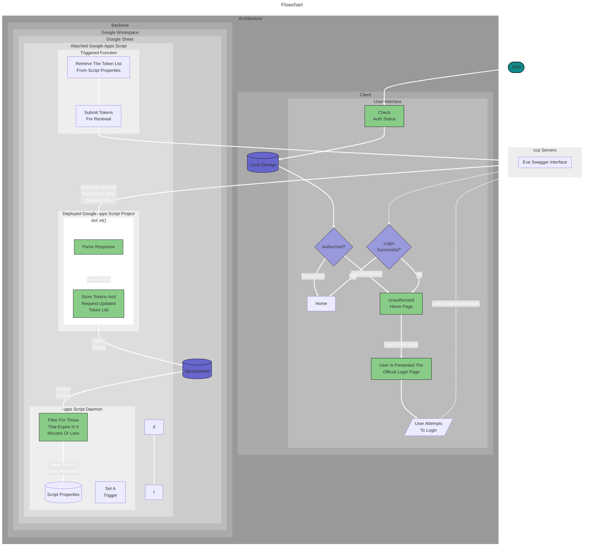

# Flowchart

```mermaid

---
title: Flowchart
---

graph TB
    
    start([Start])

    start:::terminator ==> checkAuth;

    subgraph Architecture
        direction LR;

        subgraph client["Client"]
            direction LR;

            LocalStorage[("`Local Storage`")];
        
            checkAuth:::process ==> LocalStorage;
            LocalStorage:::storedData ==> authCheck;

            subgraph interface["User Interface"]
                direction LR
            
                checkAuth["Check 
                    Auth Status"];

                authCheck{"Authorized?"};

                home["Home"];

                basicHome["Unauthorized
                    Home Page"];

                loginPage["User Is Presented The
                    Official Login Page"];

                login[/"User Attempts
                    To Login"/];

                loginSuccess{"Login
                    Successful?"};

                authCheck:::decision ==> |"Authorized?"| home;
                authCheck ==> |"Not Authorized?"| basicHome;
                basicHome:::process ==> |"User Clicks Login"| loginPage;
                loginPage:::process ==> login;

                loginSuccess:::decision ==> |"Yes"| home;
                loginSuccess ==> |"No"| basicHome;

            end

        end

        subgraph backend["Backend"]
            direction LR;

            subgraph workspace["Google Workspace"]
                direction LR;

                subgraph sheets["Google Sheet"]
                direction LR;

                    gSheet[(Spreadsheet)];

                    writeTokens:::process ==> |"New
                        Tokens"|gSheet;

                    gSheet:::storedData ==> |"Current
                        Tokens"|filterTokens;

                    subgraph appsScript["Attached Google Apps Script"]
                        direction LR;

                        subgraph deployed["Deployed Google Apps Script Project"]
                            direction LR;

                            subgraph doGet["`doGet()`"];
                                direction LR;

                                parseResponse["Parse Response"];

                                parseResponse:::process ==> |"New Tokens"| writeTokens;

                            end

                        end

                        scriptProps[("Script Properties")];

                        subgraph daemon["Apps Script Daemon"]
                            direction LR;

                            writeTokens["Store Tokens And
                                Request Updated
                                Token List"];

                            filterTokens["Filter For Those
                                That Expire In 5
                                Minutes Or Less"];

                        setTrigger["Set A
                            Trigger"];

                        filterTokens:::process ==> |"Save Tokens
                            Script Properties"| scriptProps;

                    end

                    d --- t;

                    subgraph triggeredFunction["Triggered Function"]
                        direction LR;

                        getProps["Retrieve The Token List
                            From Script Properties"];

                        renewTokens["Submit Tokens
                            For Renewal"];

                        getProps ==> renewTokens;

                    end

                end

            end

        end

    end

    end
    
    subgraph ccp["ccp Servers"];
        direction LR;

        subgraph ESI["Eve Swagger Interface"];
        
        end

    end

    login -.-> |"User's Login Credentials"| ccp ;
    renewTokens ==> ccp;
    ccp -.-> loginSuccess;
    ccp ==>|"Response Sent As
            Parameters With 
            Callback URL"| parseResponse;

style Architecture fill:#999, stroke:#666, stroke-width:0px;

style client fill:#aaa, stroke:#111, stroke-width:0px;
style interface fill:#bbb, stroke:#999, stroke-width:0px;

style backend fill:#aaa, stroke:#111, stroke-width:0px;
style workspace fill:#bbb, stroke:#111, stroke-width:0px;
style sheets fill:#ccc, stroke:#111, stroke-width:0px;
style appsScript fill:#ddd, stroke:#111, stroke-width:0px;

style deployed fill:#eee, stroke:#111, stroke-width:0px;
style doGet fill:#fff, stroke:#999, stroke-width:0px;

style daemon fill:#eee, stroke:#111, stroke-width:0px;

style triggeredFunction fill:#eee, stroke:#111, stroke-width:0px;

style ccp fill:#eee, stroke:#111, stroke-width:0px
style triggeredFunction fill:#eee, stroke:#111, stroke-width:0px;

linkStyle 0,1,2,3,4,5,6,7,8,9,10,11,12,13,14,15,16,17,18 stroke:#fff,stroke-width:3px,color:white;

classDef terminator fill:#188,stroke:#000,stroke-width:1px;
classDef dataOrInputOutput fill:#7d7,stroke:#000,stroke-width:1px;
classDef connector fill:#dd7,stroke:#000,stroke-width:1px;
classDef decision fill:#99d,stroke:#000,stroke-width:1px;
classDef document fill:#177,stroke:#000,stroke-width:1px;
classDef process fill:#8c8,stroke:#000,stroke-width:1px;
classDef preparation fill:#9b9,stroke:#000,stroke-width:1px;
classDef storedData fill:#66c,stroke:#000,stroke-width:1px;

```
