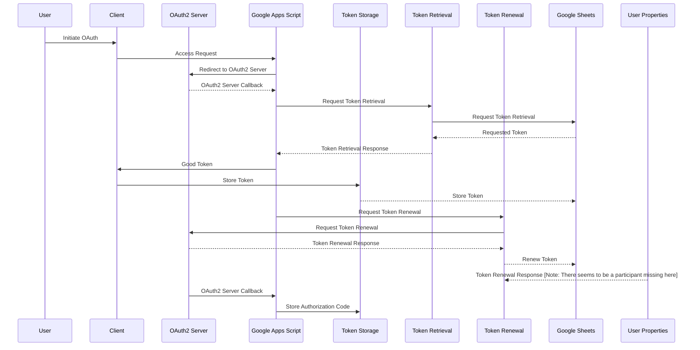

```mermaid
sequenceDiagram
    participant User
    participant Client
    participant OAuth2 Server
    participant Google Apps Script
    participant Token Storage
    participant Token Retrieval
    participant Token Renewal
    participant Google Sheets

    User->>Client: Initiate OAuth
    Client->>Google Apps Script: Access Request
    Google Apps Script->>OAuth2 Server: Redirect to OAuth2 Server
    OAuth2 Server-->>Google Apps Script: OAuth2 Server Callback
    Google Apps Script->>Token Retrieval: Request Token Retrieval
    Token Retrieval->>Google Sheets: Request Token Retrieval
    Google Sheets-->>Token Retrieval: Requested Token
    Token Retrieval-->>Google Apps Script: Token Retrieval Response
    Google Apps Script->>Client: Good Token
    Client->>Token Storage: Store Token
    Token Storage-->>Google Sheets: Store Token
    Google Apps Script->>Token Renewal: Request Token Renewal
    Token Renewal->>OAuth2 Server: Request Token Renewal
    OAuth2 Server-->>Token Renewal: Token Renewal Response
    Token Renewal-->>Google Sheets: Renew Token
    User Properties-->>Token Renewal: Token Renewal Response  [Note: There seems to be a participant missing here]
    OAuth2 Server->>Google Apps Script: OAuth2 Server Callback
    Google Apps Script->>Token Storage: Store Authorization Code
```
